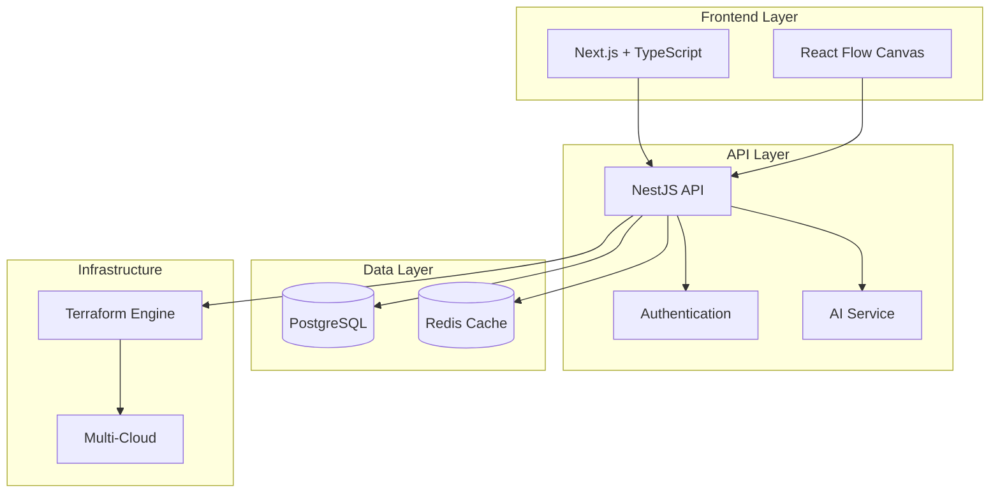

# Board3 v2

Board3 is a comprehensive, AI-powered platform for designing, deploying, and managing cloud infrastructure. It provides a visual "canvas" for end-to-end cloud operations with military-grade security and sub-millisecond performance.

## 🎯 Vision

Reduce cloud infrastructure setup time by 50% through visual design tools and AI-powered automation while enforcing security and cost optimization from the design phase.

## 📊 Project Status

🏗️ **Foundation Phase** - Documentation and architecture complete

### Completed ✅
- [x] Project repository and Git setup
- [x] Comprehensive documentation framework
- [x] Technical architecture design
- [x] Security requirements specification
- [x] Development workflow methodology

### Next Steps 📋
- [ ] Technology stack finalization
- [ ] Core infrastructure setup
- [ ] Database schema implementation
- [ ] Authentication system
- [ ] Visual designer MVP

## 🏗️ Architecture Overview



## 🔒 Security Standards

- **Encryption**: AES-256-GCM at rest, TLS 1.3 in transit
- **Authentication**: Multi-factor with hardware key support
- **Architecture**: Zero-trust with microsegmentation
- **Compliance**: OWASP Top 10, GDPR ready
- **Key Management**: HSM integration with automatic rotation

## ⚡ Performance Targets

- **API Response**: <1ms simple, <10ms complex operations
- **Database Queries**: <5ms OLTP, <50ms analytics
- **Frontend Loading**: <1.5s FCP, <3s TTI
- **AI Generation**: <10s for infrastructure designs
- **Concurrent Users**: 1,000+ with auto-scaling

## 📚 Documentation

Comprehensive documentation is available in the [`docs/`](./docs/) directory:

### 📋 Core Documentation
- **[Product Requirements](./docs/product-requirements.md)** - Complete PRD with features and specifications
- **[Technical Architecture](./docs/architecture/technical-architecture.md)** - System design and implementation
- **[Security Requirements](./docs/security/security-requirements.md)** - Military-grade security standards
- **[Development Workflow](./docs/workflows/development-workflow.md)** - Sequential methodology and quality gates

### 🚀 Quick Start
1. **Product Team**: Start with [Product Requirements](./docs/product-requirements.md)
2. **Developers**: Review [Development Workflow](./docs/workflows/development-workflow.md)
3. **DevOps**: Study [Technical Architecture](./docs/architecture/technical-architecture.md)
4. **Security**: Reference [Security Requirements](./docs/security/security-requirements.md)

## 🔄 Development Methodology

Board3 follows a **sequential development framework** with:

### Triple Self-Review Process
1. **Functionality Validation** - Requirements, testing, performance
2. **Security & Performance Audit** - OWASP compliance, optimization
3. **Architecture & Documentation Review** - Patterns, future compatibility

### Quality Gates
- ✅ **100% completion** required before next phase
- ✅ **Security validation** at every step
- ✅ **Performance targets** maintained throughout
- ✅ **Documentation updates** with each feature

### Automated Workflows
- 📝 **Auto-documentation** after feature completion
- 🔄 **Git automation** with comprehensive commit messages
- 📊 **Performance tracking** with each build
- 🛡️ **Security scanning** in CI/CD pipeline

## 🛠️ Technology Stack

### Planned Stack
- **Frontend**: Next.js 14+ with TypeScript, Tailwind CSS
- **Backend**: NestJS with TypeScript, PostgreSQL
- **Canvas**: React Flow for visual design
- **AI**: OpenAI integration for infrastructure generation
- **Infrastructure**: Terraform for multi-cloud deployment
- **Authentication**: Auth0 or Supabase with MFA support

## 🚀 Getting Started

### Prerequisites
- Node.js 20+
- PostgreSQL 15+
- Redis 7+
- Docker (optional)

### Development Setup
*(Setup instructions will be added as infrastructure is implemented)*

```bash
# Clone repository
git clone https://github.com/techappsUT/board3-v2.git
cd board3-v2

# Install dependencies
npm install

# Setup development environment
# (Instructions coming with Phase 1 implementation)
```

## 🤝 Contributing

Board3 follows strict sequential development. Please review:

1. [Development Workflow](./docs/workflows/development-workflow.md) for process
2. [Security Requirements](./docs/security/security-requirements.md) for standards
3. [Technical Architecture](./docs/architecture/technical-architecture.md) for implementation

## 📈 Roadmap

### Phase 1: Foundation (Months 1-2)
- Core infrastructure and security setup
- Database schema and basic API
- Authentication and authorization

### Phase 2: Core Features (Months 2-4)
- Visual designer with drag-and-drop
- Terraform code generation
- Basic multi-cloud support

### Phase 3: Advanced Features (Months 4-6)
- AI-powered infrastructure generation
- Real-time collaboration
- CI/CD integration and drift detection

### Phase 4: Enterprise (Months 6+)
- Advanced integrations
- Compliance and governance features
- Performance optimization and scaling

## 📄 License

*(License to be determined)*

---

🤖 Generated with [Claude Code](https://claude.ai/code)