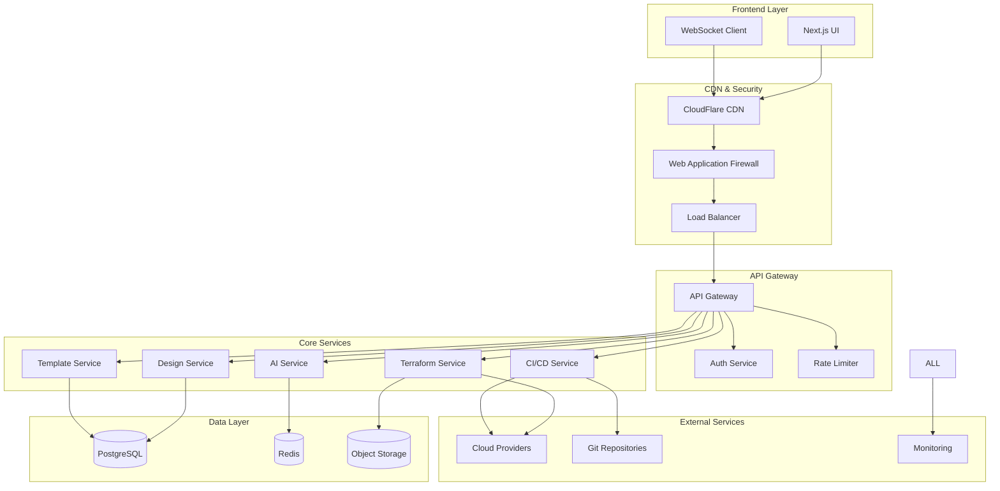

# Board3 Technical Architecture

## Overview

Board3 follows a modern, microservices-oriented architecture with military-grade
security and sub-millisecond performance targets. The system is designed for
scalability, maintainability, and zero-trust security principles.

## System Architecture



## Technology Stack

### Frontend Architecture

- **Framework**: Next.js 14+ with App Router
- **Language**: TypeScript (strict mode)
- **Styling**: Tailwind CSS with CSS-in-JS for dynamic themes
- **State Management**: Zustand with persist middleware
- **Real-time**: Socket.io client for collaborative editing
- **Canvas**: React Flow for visual design interface

**Performance Targets**:

- First Contentful Paint: <1.5s
- Time to Interactive: <3s
- Bundle size: <100KB critical path
- Lighthouse score: >90

### Backend Architecture

- **Runtime**: Node.js 20+ with TypeScript
- **Framework**: NestJS for modular, scalable architecture
- **Authentication**: JWT with refresh tokens, hardware key support
- **Database**: PostgreSQL 15+ with read replicas
- **Caching**: Redis Cluster for high availability
- **Message Queue**: BullMQ for background jobs

**Performance Targets**:

- API response: <1ms simple queries, <10ms complex operations
- Database queries: <5ms OLTP, <50ms analytics
- AI generation: <10s for infrastructure designs
- Concurrent users: 1,000+ with auto-scaling

## Service Architecture

### Design Service

**Responsibilities**:

- Visual canvas state management
- Real-time collaboration via WebSockets
- Component library management
- Export/import functionality

**Database Schema**:

```sql
-- Projects and designs
CREATE TABLE projects (
    id UUID PRIMARY KEY,
    name VARCHAR(255) NOT NULL,
    description TEXT,
    owner_id UUID NOT NULL,
    created_at TIMESTAMP DEFAULT NOW(),
    updated_at TIMESTAMP DEFAULT NOW(),
    FOREIGN KEY (owner_id) REFERENCES users(id)
);

CREATE TABLE designs (
    id UUID PRIMARY KEY,
    project_id UUID NOT NULL,
    name VARCHAR(255) NOT NULL,
    canvas_data JSONB NOT NULL,
    terraform_code TEXT,
    version INTEGER DEFAULT 1,
    created_at TIMESTAMP DEFAULT NOW(),
    FOREIGN KEY (project_id) REFERENCES projects(id)
);
```

### AI Service

**Responsibilities**:

- Natural language processing for infrastructure requests
- Code generation and validation
- Best practice recommendations
- Cost optimization suggestions

**Implementation**:

```typescript
interface AIRequest {
  prompt: string;
  context: {
    cloudProvider: 'aws' | 'azure' | 'gcp' | 'oci';
    existingResources?: Resource[];
    constraints?: Constraints;
  };
}

interface AIResponse {
  generatedCode: string;
  recommendations: string[];
  estimatedCost: number;
  securityScore: number;
}
```

### Terraform Service

**Responsibilities**:

- Terraform code generation and validation
- State management with encrypted backends
- Drift detection and remediation
- Multi-cloud provider support

**State Management**:

```typescript
interface TerraformState {
  id: string;
  projectId: string;
  provider: CloudProvider;
  backend: {
    type: 'remote';
    encryption: 'AES-256-GCM';
    location: string;
  };
  resources: TerraformResource[];
  lastApplied: Date;
  driftStatus: 'none' | 'detected' | 'remediated';
}
```

### CI/CD Service

**Responsibilities**:

- Pipeline orchestration
- Pre-deployment security scanning
- Automated testing and validation
- Deployment automation

**Pipeline Configuration**:

```yaml
stages:
  - validate:
      - terraform_validate
      - security_scan
      - cost_analysis
  - plan:
      - terraform_plan
      - impact_analysis
  - apply:
      - terraform_apply
      - post_deployment_tests
```

## Security Architecture

### Zero-Trust Implementation

- **Principle**: Never trust, always verify
- **Implementation**:
  - All API calls require valid JWT tokens
  - Service-to-service mTLS communication
  - Encrypted data at rest and in transit
  - Continuous security monitoring

### Encryption Standards

- **At Rest**: AES-256-GCM for database encryption
- **In Transit**: TLS 1.3 minimum, mTLS for services
- **Keys**: Hardware Security Module (HSM) integration
- **Secrets**: Encrypted environment variables, automatic rotation

### Authentication & Authorization

```typescript
interface SecurityContext {
  user: {
    id: string;
    roles: Role[];
    permissions: Permission[];
  };
  session: {
    token: string;
    expiresAt: Date;
    mfaVerified: boolean;
  };
  request: {
    ip: string;
    userAgent: string;
    riskScore: number;
  };
}
```

## Data Architecture

### PostgreSQL Schema Design

```sql
-- Users and authentication
CREATE TABLE users (
    id UUID PRIMARY KEY DEFAULT gen_random_uuid(),
    email VARCHAR(255) UNIQUE NOT NULL,
    password_hash VARCHAR(255) NOT NULL,
    mfa_secret VARCHAR(255) ENCRYPTED,
    created_at TIMESTAMP DEFAULT NOW(),
    last_login TIMESTAMP
);

-- Role-based access control
CREATE TABLE roles (
    id UUID PRIMARY KEY DEFAULT gen_random_uuid(),
    name VARCHAR(100) NOT NULL,
    permissions JSONB NOT NULL
);

CREATE TABLE user_roles (
    user_id UUID REFERENCES users(id),
    role_id UUID REFERENCES roles(id),
    PRIMARY KEY (user_id, role_id)
);

-- Templates and standardization
CREATE TABLE templates (
    id UUID PRIMARY KEY DEFAULT gen_random_uuid(),
    name VARCHAR(255) NOT NULL,
    description TEXT,
    template_data JSONB NOT NULL,
    tags TEXT[],
    is_public BOOLEAN DEFAULT FALSE,
    created_by UUID REFERENCES users(id),
    created_at TIMESTAMP DEFAULT NOW()
);
```

### Redis Caching Strategy

```typescript
interface CacheStrategy {
  sessions: {
    ttl: '24h';
    pattern: 'session:${userId}';
  };
  designs: {
    ttl: '1h';
    pattern: 'design:${projectId}:${designId}';
  };
  terraform: {
    ttl: '30m';
    pattern: 'tf:${stateId}';
  };
  aiResponses: {
    ttl: '6h';
    pattern: 'ai:${hash(prompt)}';
  };
}
```

## Integration Architecture

### Cloud Provider Integration

```typescript
interface CloudProvider {
  name: 'aws' | 'azure' | 'gcp' | 'oci';
  credentials: EncryptedCredentials;
  regions: Region[];
  services: CloudService[];
  quotas: ResourceQuota[];
}

interface CloudService {
  name: string;
  type: string;
  icon: string;
  terraformProvider: string;
  cost: CostModel;
  security: SecurityPolicy;
}
```

### Git Integration

```typescript
interface GitIntegration {
  provider: 'github' | 'gitlab' | 'bitbucket';
  repository: {
    url: string;
    branch: string;
    path: string;
  };
  webhook: {
    url: string;
    secret: string;
    events: WebhookEvent[];
  };
  sync: {
    automatic: boolean;
    onDesignSave: boolean;
    onDeploy: boolean;
  };
}
```

## Performance Optimization

### Database Optimization

```sql
-- Indexes for performance
CREATE INDEX CONCURRENTLY idx_designs_project_id ON designs(project_id);
CREATE INDEX CONCURRENTLY idx_designs_updated_at ON designs(updated_at);
CREATE INDEX CONCURRENTLY idx_projects_owner_id ON projects(owner_id);

-- Partitioning for large datasets
CREATE TABLE audit_logs (
    id UUID DEFAULT gen_random_uuid(),
    timestamp TIMESTAMP NOT NULL,
    user_id UUID,
    action VARCHAR(100),
    resource_id UUID,
    details JSONB
) PARTITION BY RANGE (timestamp);
```

### Caching Layers

1. **L1**: In-memory application cache (Node.js Map)
2. **L2**: Redis cluster for distributed caching
3. **L3**: CDN for static assets and API responses

### API Optimization

```typescript
// Response compression and optimization
app.use(compression());
app.use(helmet());

// Database connection pooling
const pool = new Pool({
  host: process.env.DB_HOST,
  port: process.env.DB_PORT,
  database: process.env.DB_NAME,
  user: process.env.DB_USER,
  password: process.env.DB_PASSWORD,
  max: 20, // Maximum connections
  idleTimeoutMillis: 30000,
  connectionTimeoutMillis: 2000,
});
```

## Deployment Architecture

### Containerization

```dockerfile
# Multi-stage build for optimization
FROM node:20-alpine AS builder
WORKDIR /app
COPY package*.json ./
RUN npm ci --only=production

FROM node:20-alpine AS runtime
WORKDIR /app
COPY --from=builder /app/node_modules ./node_modules
COPY . .
EXPOSE 3000
CMD ["npm", "start"]
```

### Kubernetes Configuration

```yaml
apiVersion: apps/v1
kind: Deployment
metadata:
  name: board3-api
spec:
  replicas: 3
  selector:
    matchLabels:
      app: board3-api
  template:
    metadata:
      labels:
        app: board3-api
    spec:
      containers:
        - name: api
          image: board3/api:latest
          ports:
            - containerPort: 3000
          env:
            - name: DB_HOST
              valueFrom:
                secretKeyRef:
                  name: db-secret
                  key: host
          resources:
            requests:
              memory: '256Mi'
              cpu: '250m'
            limits:
              memory: '512Mi'
              cpu: '500m'
```

## Monitoring and Observability

### Metrics Collection

```typescript
interface Metrics {
  api: {
    responseTime: Histogram;
    requestCount: Counter;
    errorRate: Gauge;
  };
  database: {
    connectionPool: Gauge;
    queryDuration: Histogram;
    slowQueries: Counter;
  };
  terraform: {
    planDuration: Histogram;
    applySuccess: Counter;
    driftDetected: Counter;
  };
}
```

### Distributed Tracing

```typescript
import { trace, SpanKind } from '@opentelemetry/api';

const tracer = trace.getTracer('board3-api');

async function createDesign(data: DesignData) {
  const span = tracer.startSpan('createDesign', {
    kind: SpanKind.SERVER,
    attributes: {
      'design.type': data.type,
      'project.id': data.projectId,
    },
  });

  try {
    const result = await designService.create(data);
    span.setStatus({ code: SpanStatusCode.OK });
    return result;
  } catch (error) {
    span.recordException(error);
    span.setStatus({ code: SpanStatusCode.ERROR });
    throw error;
  } finally {
    span.end();
  }
}
```

## Scalability Considerations

### Horizontal Scaling

- **API Services**: Stateless design for easy horizontal scaling
- **Database**: Read replicas for query distribution
- **Redis**: Cluster mode for high availability
- **File Storage**: Object storage for terraform states and designs

### Auto-scaling Configuration

```yaml
apiVersion: autoscaling/v2
kind: HorizontalPodAutoscaler
metadata:
  name: board3-api-hpa
spec:
  scaleTargetRef:
    apiVersion: apps/v1
    kind: Deployment
    name: board3-api
  minReplicas: 3
  maxReplicas: 20
  metrics:
    - type: Resource
      resource:
        name: cpu
        target:
          type: Utilization
          averageUtilization: 70
    - type: Resource
      resource:
        name: memory
        target:
          type: Utilization
          averageUtilization: 80
```

## Security Implementation

### Input Validation

```typescript
import { z } from 'zod';

const CreateDesignSchema = z.object({
  name: z.string().min(1).max(255),
  projectId: z.string().uuid(),
  canvasData: z.object({
    nodes: z.array(
      z.object({
        id: z.string(),
        type: z.string(),
        position: z.object({
          x: z.number(),
          y: z.number(),
        }),
        data: z.record(z.any()),
      })
    ),
    edges: z.array(
      z.object({
        id: z.string(),
        source: z.string(),
        target: z.string(),
      })
    ),
  }),
});
```

### Rate Limiting

```typescript
import rateLimit from 'express-rate-limit';

const apiLimiter = rateLimit({
  windowMs: 15 * 60 * 1000, // 15 minutes
  max: 100, // Limit each IP to 100 requests per windowMs
  message: 'Too many requests from this IP',
  standardHeaders: true,
  legacyHeaders: false,
});

const aiLimiter = rateLimit({
  windowMs: 60 * 1000, // 1 minute
  max: 5, // Limit AI requests to 5 per minute
  keyGenerator: (req) => req.user.id, // Per user limit
});
```

This technical architecture provides a comprehensive foundation for building
Board3 with enterprise-grade security, performance, and scalability
requirements.
